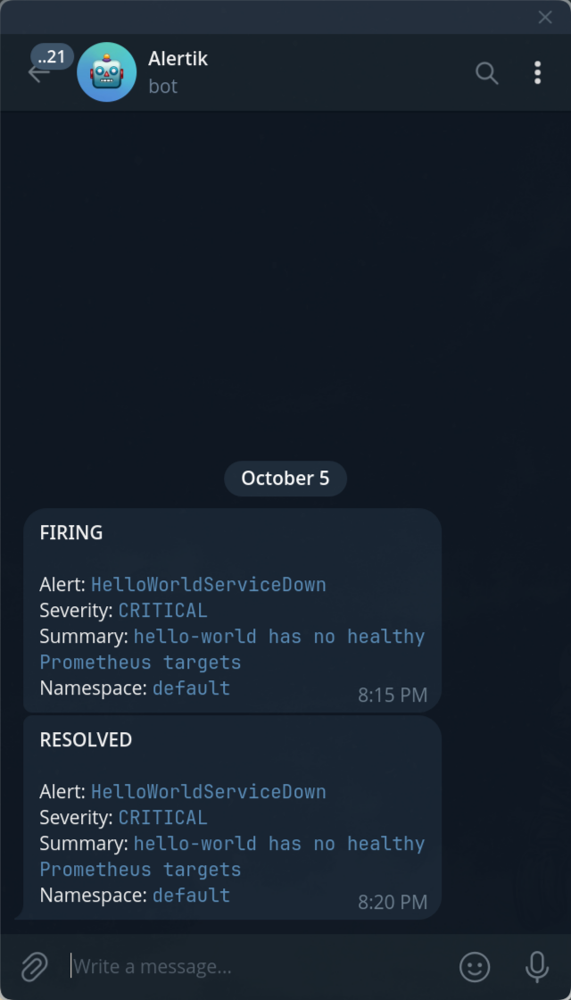

# devops-lab

Поднимем `hello-world` сервис на Go в Minikube кластере с 2 репликами и настроим мониторинг с алертами в Telegram.

## Tech Stack
Go, Docker, Kubernetes (Minikube), Helm, Grafana, Prometheus

---

## Docker-образ
Образ с `hello-world` сервисом на Go.

### Сборка
```sh
docker build -t jduun/hello-world:0.1.0 .
```

### Публикация
```sh
docker login
docker push jduun/hello-world:0.1.0
```
Образ на Docker Hub: https://hub.docker.com/r/jduun/hello-world.

### Проверка на уязвимости
```sh
trivy image jduun/hello-world:0.1.0@sha256:5fb84584ca03014a8f42faeb504726cae02035dee38119fc596b069d088981d7
```

---

## API приложения

### `GET /`
#### Описание
Основной эндпоинт сервиса.

#### Ответ
Статус: `200 OK`

```json
{
  "message": "Hello World"
}
```

### `GET /ready`
#### Описание
Проверка готовности сервиса.

#### Ответ
Статус: `200 OK`

```json
{
  "status": "ok"
}
```

### `GET /health`
#### Описание
Проверка работоспособности приложения.

#### Ответ
Статус: `200 OK`

```json
{
  "status": "ok"
}
```

### `GET /metrics`
#### Описание
Отдает метрики для Prometheus.

#### Ответ
Статус: `200 OK`

```
# HELP <metric_name> <описание>
# TYPE <metric_name> <тип>
<metric_name>{label="value"} <число>
```

---

## Запуск Minikube-кластера
```sh
minikube start
```

---

## Мониторинг
### Установка
Установите инструменты для мониторинга ([kube-prometheus-stack](https://github.com/prometheus-community/helm-charts/tree/main/charts/kube-prometheus-stack)):
```sh
helm upgrade --install monitoring \
  oci://ghcr.io/prometheus-community/charts/kube-prometheus-stack \
  --namespace monitoring \
  --create-namespace
```

### Алерты

Создайте бота через [@BotFather](https://t.me/BotFather).

Установите токен:
```sh
printf 'Telegram bot token: '; read -s TELEGRAM_BOT_TOKEN; printf '\n'
```

Напишите боту и найдите `result[].message.chat.id` нужного чата:
```sh
curl --silent "https://api.telegram.org/bot$TELEGRAM_BOT_TOKEN/getUpdates"
```

Создайте `secrets.yaml`:

```sh
cp ./charts/monitoring/secrets.example.yaml ./charts/monitoring/secrets.yaml
```

Укажите токен и найденный `chat_id` в `charts/monitoring/secrets.yaml`:
```yaml
telegram:
  botToken: "<TELEGRAM_BOT_TOKEN>"
  chatId: <CHAT_ID>
```

Установите chart с Telegram интеграций в тот же namespace, что и приложение:

```sh
helm upgrade --install telegram-alerts ./charts/monitoring \
  --namespace default \
  --values ./charts/monitoring/secrets.yaml
```

Доступные алерты:

| Алерт | Условие                                        | Важность |
| --- |------------------------------------------------| --- |
| `HelloWorldServiceDown` | нет доступных targets более 20 секунд          | critical |
| `HelloWorldContainerRestarted` | контейнер перезапустился за последние 10 минут | warning |
| `HelloWorldHighCPU` | CPU выше 80% лимита более 5 минут              | warning |
| `HelloWorldHighMemory` | память выше 80% лимита более 5 минут           | warning |

Пороги и интервалы настраиваются в секции `alerts` файла `charts/hello-world/values.yaml`.

Проверьте Telegram-конфигурации:

```sh
kubectl get alertmanagerconfig telegram-alerts-monitoring
```

---

## Поднимаем сервис
### Установка
```sh
helm upgrade --install prod ./charts/hello-world
```
Проверяем установку:

```sh
kubectl get deploy,pods,svc
```

Проверка создания Prometheus правил:
```sh
kubectl get prometheusrule prod-hello-world
```

### Запрос к сервису
Проброс портов:
```sh
minikube tunnel
```

Получаем `EXTERNAL-IP`:
```sh
kubectl get svc prod-hello-world
```

Запрос:
```sh
curl "http://<EXTERNAL-IP>:80/"
```
Или переходим в браузере по этой ссылке.

---

## Проверка алертов
Для проверки алертов временно остановите приложение:

```sh
kubectl scale deployment prod-hello-world --replicas=0
```

Верните реплики после получения алерта. Alertmanager отправит сообщение со статусом `RESOLVED`:

```sh
kubectl scale deployment prod-hello-world --replicas=2
```

## Grafana
Логин:
```
admin
```
Пароль:
```sh
kubectl -n monitoring get secret monitoring-grafana \
  -o jsonpath="{.data.admin-password}" | base64 -d
echo
```

Можно посмотреть на метрики пода под нагрузкой:
```sh
kubectl run load-test \
  --rm -it \
  --restart=Never \
  --image=fortio/fortio \
  -- load \
  -qps 0 \
  -c 20 \
  -t 1m \
  http://<EXTERNAL_IP>:80/cpu
```

## Результаты

### Скриншот (развертка сервиса)


### Метрики пода в Grafana


### Алерты в Telegram


### Схема Minikube-кластера

