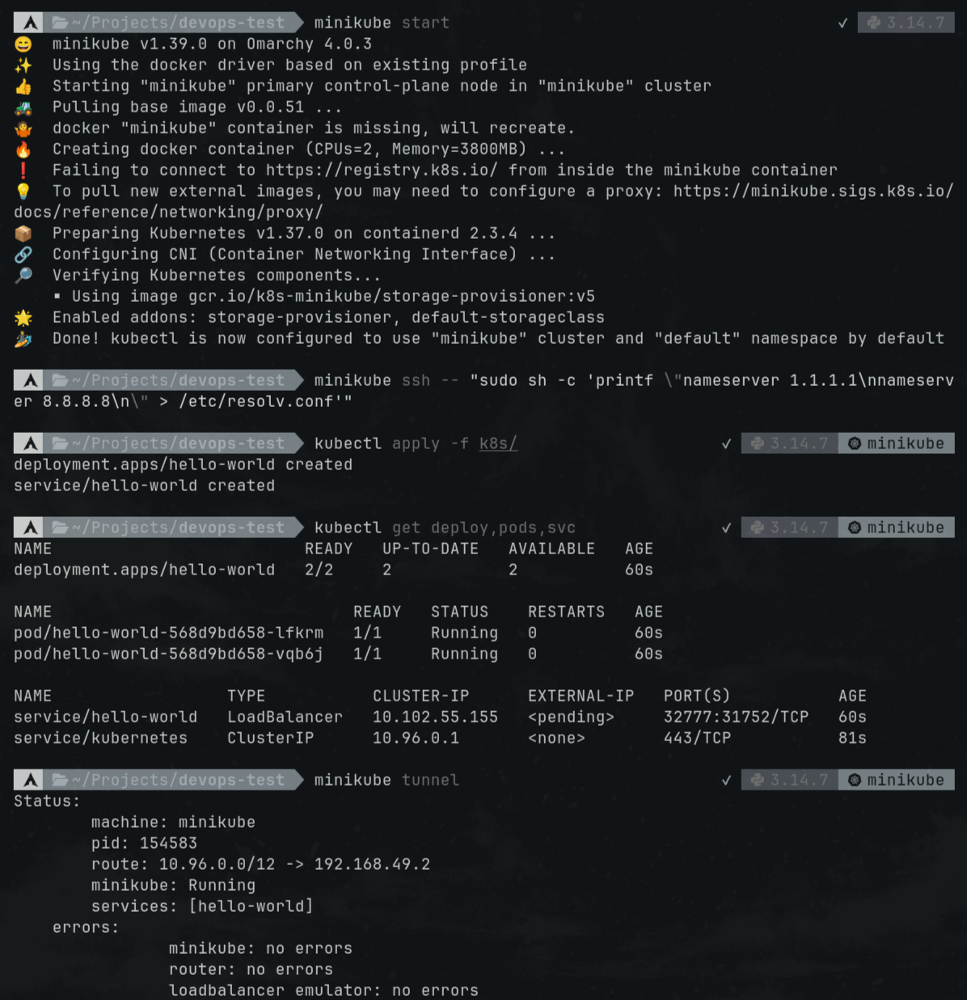
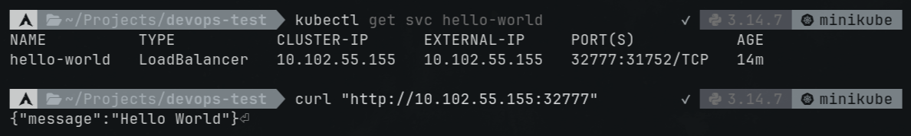
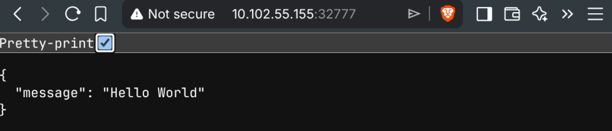

# devops-lab

Поднимем простой веб-сервис в Minikube кластере с 2 репликами. Docker-образ приложения на Docker Hub: https://hub.docker.com/r/jduun/hello-world.

## Запуск в Minikube

### 1. Запуск Minikube кластера
```sh
minikube start
```

### 2. Фикс проблемы с DNS
```sh
minikube ssh -- "sudo sh -c 'printf \"nameserver 1.1.1.1\nnameserver 8.8.8.8\n\" > /etc/resolv.conf'"
```

### 3. Применяем манифесты
```sh
kubectl apply -f k8s/
```

### 4. Проверяем установку
```sh
kubectl get deploy,pods,svc
```

### 5. Проброс портов
```sh
minikube tunnel
```

### 6. Получаем `EXTERNAL-IP`  
```sh
kubectl get svc hello-world
```

### 7. Запрос к сервису
```sh
curl "http://<EXTERNAL-IP>:32777"
```
Или переходим в браузере по этой ссылке.

## Результаты

### Скриншоты






### Схема Minikube-кластера


