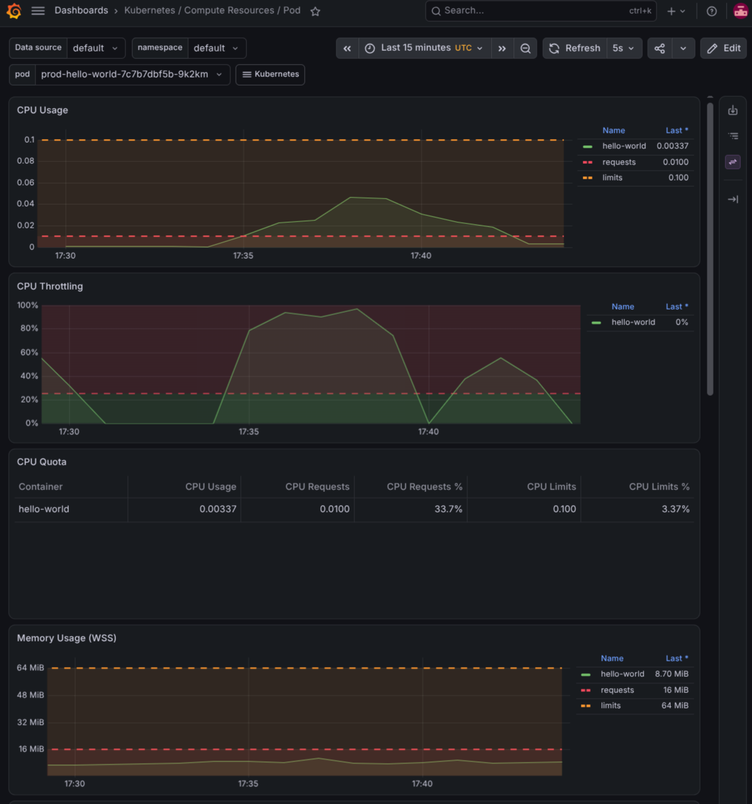
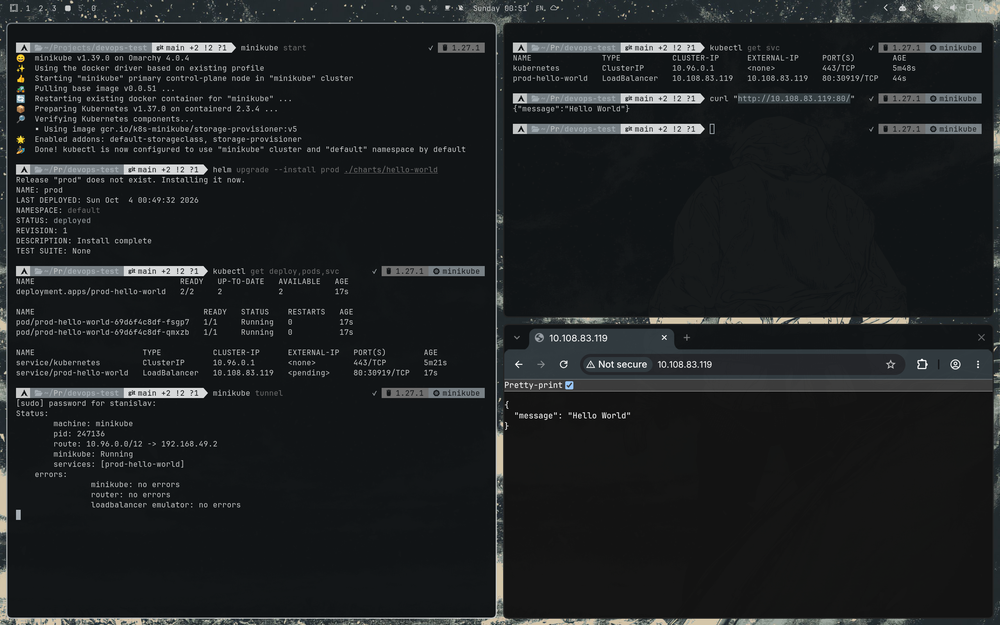
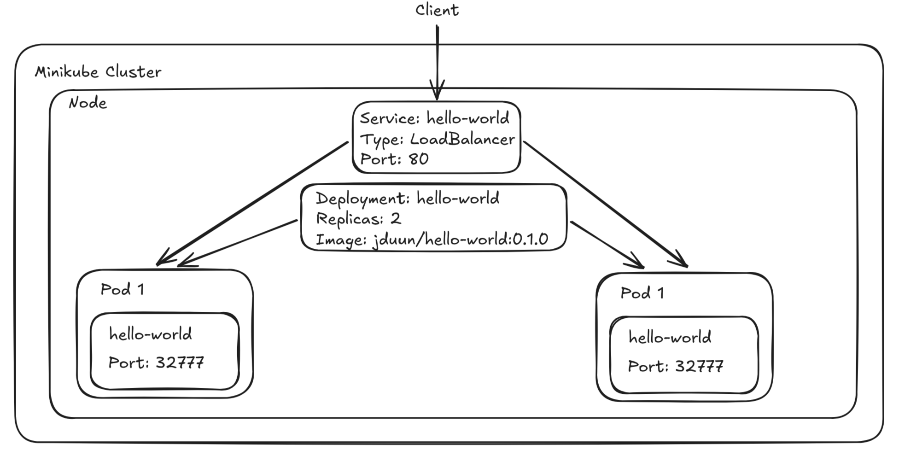

# devops-lab

Поднимем `hello-world` сервис на Go в Minikube кластере с 2 репликами.

## Tech Stack
Go, Docker, Kubernetes (Minikube), Helm, Grafana, Prometheus

## Docker-образ
### Сборка
```sh
docker build -t jduun/hello-world:0.1.0 .
```

### Публикация
```sh
docker login
docker push jduun/hello-world:0.1.0
```
Образ на Docker Hub: https://hub.docker.com/r/jduun/hello-world.

### Проверка на уязвимости
```sh
trivy image jduun/hello-world:0.1.0@sha256:5fb84584ca03014a8f42faeb504726cae02035dee38119fc596b069d088981d7
```

## API приложения

### `GET /`
#### Описание
Основной эндпоинт сервиса.

#### Ответ
Статус: `200 OK`

```json
{
  "message": "Hello World"
}
```

### `GET /ready`
#### Описание
Проверка готовности сервиса.

#### Ответ
Статус: `200 OK`

```json
{
  "status": "ok"
}
```


### `GET /health`
#### Описание
Проверка работоспособности приложения.

#### Ответ
Статус: `200 OK`

```json
{
  "status": "ok"
}
```

### `GET /metrics`
#### Описание
Отдает метрики для Prometheus.

#### Ответ
Статус: `200 OK`

```
# HELP <metric_name> <описание>
# TYPE <metric_name> <тип>
<metric_name>{label="value"} <число>
```

## Запуск в Minikube

### Запуск Minikube кластера
```sh
minikube start
```

### Просмотр сгенерированных манифестов
```sh
helm template prod ./charts/hello-world
```

### Установка Helm chart
```sh
helm upgrade --install prod ./charts/hello-world
```

### Проверяем установку
```sh
kubectl get deploy,pods,svc
```

### Проброс портов
```sh
minikube tunnel
```

### Получаем `EXTERNAL-IP`
```sh
kubectl get svc prod-hello-world
```

### Запрос к сервису
```sh
curl "http://<EXTERNAL-IP>:80"
```
Или переходим в браузере по этой ссылке.

### Удаление релиза
```sh
helm uninstall prod
```

## Мониторинг
### Установка
Установка инструменты для мониторинга:
```sh
helm upgrade --install monitoring \
  oci://ghcr.io/prometheus-community/charts/kube-prometheus-stack \
  --namespace monitoring \
  --create-namespace
```

### Grafana
Логин:
```
admin
```
Пароль:
```sh
kubectl -n monitoring get secret monitoring-grafana \
  -o jsonpath="{.data.admin-password}" | base64 -d
echo
```

### Нагрузочный тест
```sh
kubectl run load-test \
  --rm -it \
  --restart=Never \
  --image=fortio/fortio \
  -- load \
  -qps 0 \
  -c 20 \
  -t 1m \
  http://<EXTERNAL_IP>:80/cpu
```

### Метрики пода


## Результаты

### Скриншот


### Схема Minikube-кластера

